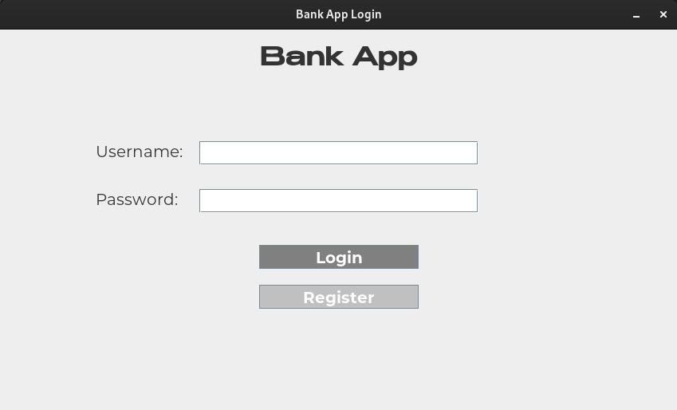
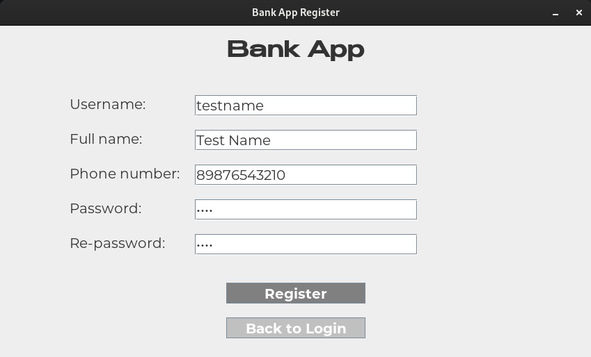
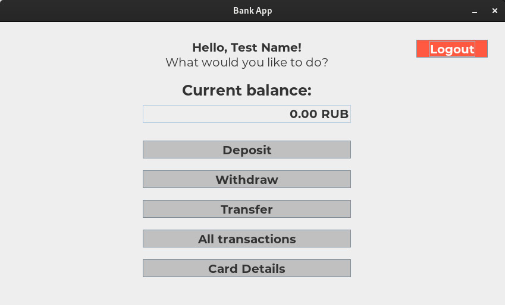

## Simple bank system app

A simple bank system application with a graphic user interface developed in Java.

### Features:

- Account:
  - login to existing account;
  - logout of the account;
  - register a new account & get card details;
- Bank system:
  - check balance;
  - deposit funds;
  - withdraw funds;
  - transfer funds to other user;
  - view transaction history;
  - view card details;

### Technologies:

- JDK 21
- Swing framework
- MySQL database

### Screenshots:

